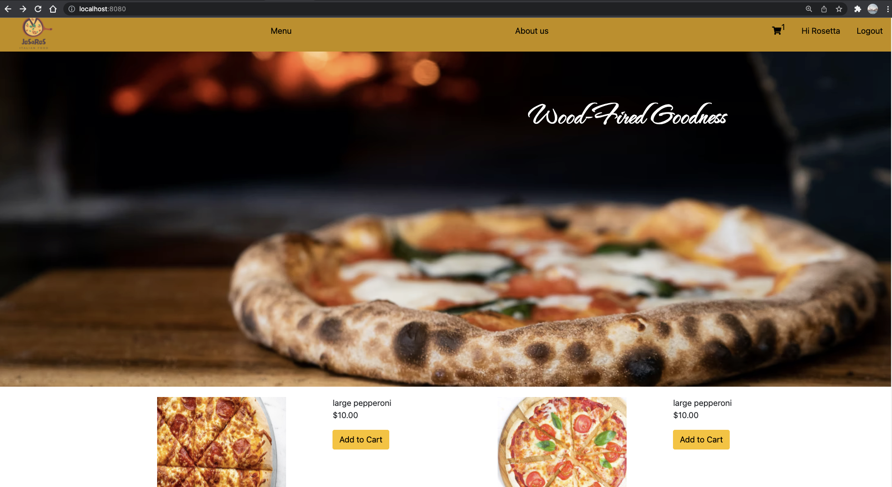
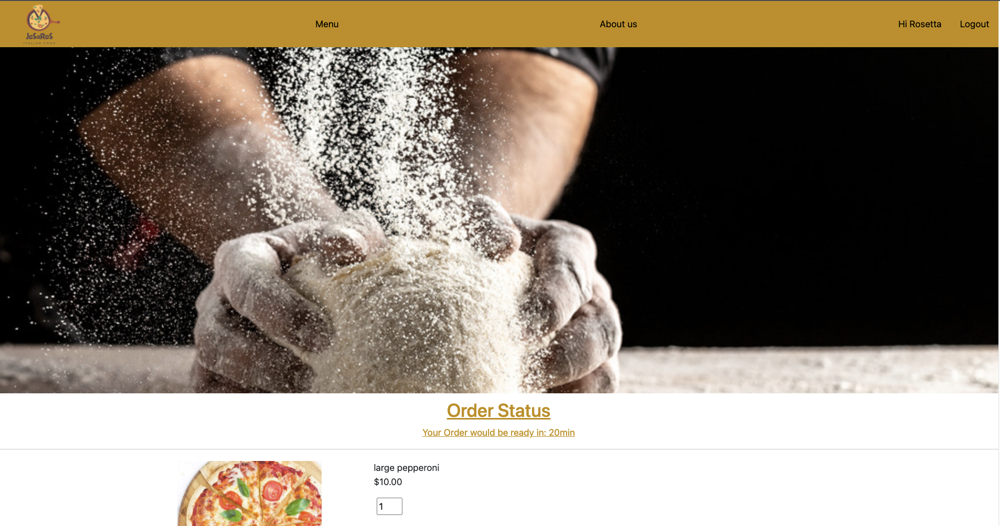
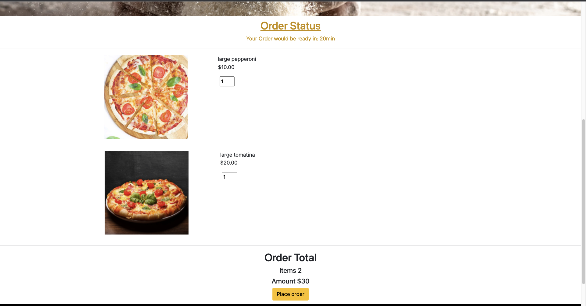
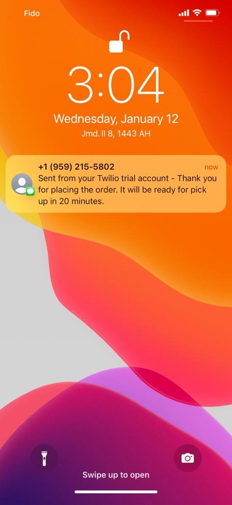

JoSaRoS food ordering App
=========================

JoSaRoS is an Italian food ordering app for a fictional restaurant.It is a full stack app.
Users can select the product from the menu and add items to their cart. The order once placed, is confirmed by the restaurant by sending a confirmation SMS to the customer for the order.

* Backend is built using Node.js, PostgreSql.

* Frontend is built using HTML, CSS, JQuery and Javascript.

* The Twilio API is used for sending messages to the customer mobile.

Authors
=======
Sahar Halim, Jovita Pais and Rofiat Olusanya.

Final Products
==============

## Getting Started

1. Create the `.env` by using `.env.example` as a reference: `cp .env.example .env`
2. Update the .env file with your correct local information 
  - username: `labber` 
  - password: `labber` 
  - database: `midterm`
3. Install dependencies: `npm i`
4. Fix to binaries for sass: `npm rebuild node-sass`
5. Reset database: `npm run db:reset`
  - Check the db folder to see what gets created and seeded in the SDB
7. Run the server: `npm run local`
  - Note: nodemon is used, so you should not have to restart your server
8. Visit `http://localhost:8080/`

## Dependencies

- Node 10.x or above
- NPM 5.x or above
- PG 6.x
- chalk: ^2.4.2,
- dotenv: ^2.0.0,
- ejs: ^2.6.2,
- express: ^4.17.1,
- morgan: ^1.9.1,
- pg: ^8.5.0,
- pg-native: ^3.0.0,
- requirejs: ^2.3.6,
- sass: ^1.35.1,
- twilio: ^3.73.0
- devDependencies: 
- nodemon: ^2.0.10
